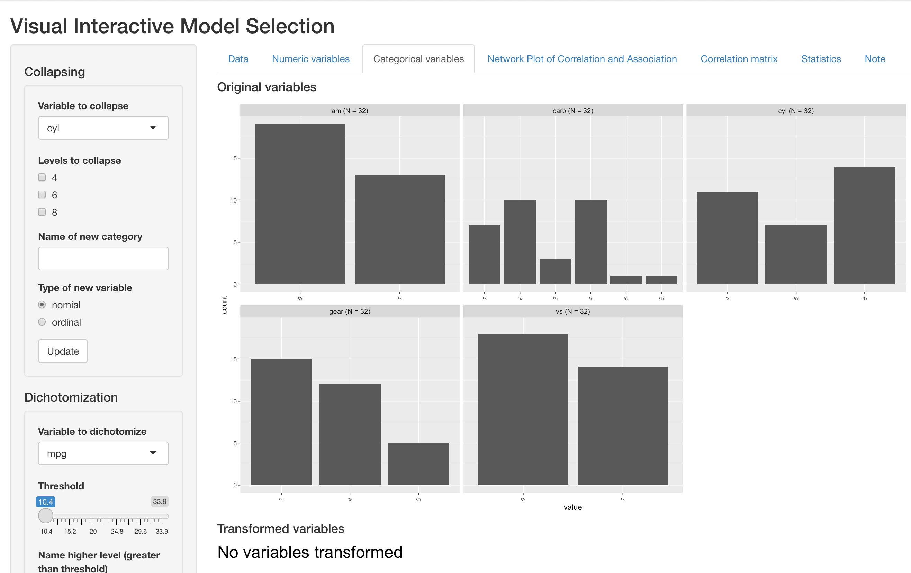

```{r, include = FALSE}
knitr::opts_chunk$set(
  collapse = TRUE,
  comment = "#>"
)
```

```{r setup}
library(devtools)
data("mtcars")
```

# Introduction 

The VisX application is composed of five tabs, corresponding two fives steps of data pre-processing or variable selection. Each tab consists of an input panel on the left side and an output panel on the right side. The contend of these panels are different across tabs, based on functionality each of them supports.v In the following sections, we will illustrate the VisX workflow using "mtcars" data as an example. This data is a built-in data set of R and comprises fuel consumption and 10 aspects of automobile design and performance for 32 automobiles (1973--74 models). Please note that the original R dataset contains only numeric variable. For illustration puporses, we have created two categorical variables (vs_fct and am_fct) based on original dummy variables (vs and am). 

# Uplaod data

The data tab, which is the first tab in VisX tab, supports uploading data from local directory and initializing variable sets for following analysis. This app supports only csv files at this point. 

As illustrated below, users can choose csv files from their own devices by clicking "Browse" on the left input panel. Once the data is uploaded, a list of variable names of all the columns in uploaded spreadsheet will appear in the left side panel. User can deselect variables not of interest so that they would be removed from the following analysis. "Initialize" button completes the initialization process, and a preview of the whole data set will appear on the right ouput panel. 

```{r, echo=FALSE, out.width = '100%', fig.cap="Data tab"}
knitr::include_graphics("tab1.png")
```


# Pre-preocessing

The following two tabs supports operations on data pre-processing for numeric and categorical variables respectively. 

## Numeric variables

This tab presents histograms for each numeric variable in the dataset, where mean and one standard deviation around mean marked out respectively with solid and dashed red lines. It also supports the following operations for pre-processing:

- Univariate transformation: log/square-root
- Multivariate transformation: mean/ratio. Ratio can only be implemented on two variables. 

The left input panel provides a list of names of all the variables in the dataset. It is reactive to not only previous data initialization, but also operations from users to create new variables, meaning the new variables user created will also appear on the left input panel. The visual feedback of newly created variables will appear below in the "Transformed variables" section, where distribution of new variables will be presented in the same way as original variables. 

Below are examples of log transformation and creating ratios. 

```{r, echo=FALSE, out.width = '100%', fig.cap="Log transformation"}
knitr::include_graphics("tab2-1.png")
```

```{r, echo=FALSE, out.width = '100%', fig.cap="Creating ratio of two variables"}
knitr::include_graphics("tab2-2.png")
```

```{r, echo=FALSE, out.width = '100%', fig.cap="Reactive visual feedback"}
knitr::include_graphics("tab2-3.png")
```


## Categorical variables

This tab presents barplot for each categorical variable in the dataset. It supports the following operations for pre-processing

- Collapsing levels of existing categorical variables
- Creating new categorical variable by dichotomization of numeric variables

For collasping, user can first choose the variable to collapse from the dropdown manu at the top of left input panel. A list of all levels in this variable will appear reactively. User can then specify the levels to collapse and name the new category as needed. Barplots of the new variables will appear reactively in the "Transfomed variables" section at the bottom of right output panel. Below is an example of collapsing two categories of "am" into one overall category. Please note that this example is only for illustration purposes. In reality, we usually avoid single-level categorical variables. This operation is often used when there are too many levels in one single variable with small sample size within each level. 

```{r, echo=FALSE, out.width = '100%', fig.cap="Collpasing"}

```

For Dichotomization, user can forst specify the variable to dichotomize, and a slidebar of range of the corresponding numeric variable will show up reactively. User can then specify a cutoff point, and name the two new levels as needed. Barplots of the newly created categorical variables will also appear reactively in the "Transfomed variables" section at the bottom of right output panel. Below is an example of cutting weight by 3lbs. 

```{r, echo=FALSE, out.width = '100%', fig.cap="Dichotomization"}
knitr::include_graphics("tab3-2.png")
```


Please note that the left input panel is also reactive to user operation, meaning the newly created categorical variables will appear in the input list under "variables to collapse" at the top left corner. Additional operations can be implemented iteratively on these variables as well. 

# Correlation

The following three tabs present some basic information for variable selection. In "Correlation Structure Diagram" tab, the inter-correlation between variables is presented in a network. "VisX information" provides statistics of mutli-collinearity, and "Correlation" presents the whole pairwise correlation matrix. 

## Correlation diagram

In the left input panel, a list of variables names is presented, including original variables as well as the new variables created previously by the user. Selected variables will be included in the correlation diagram on right output panel. The thickness of edges represents value of Spearman correlation coefficient, where correlation with categorical variables are calculated by creating dummy variables corresponding to each level. A black line overlaying such edges will show up if the correlation is also significant by Spearman correlation test. Variables that are strongly correlated are also clustered closer to each other in 2D space.

By default, the diagram displays all original variables, and set the majority level of categorical variables as reference level. However, that can be changed by selecting/deselecting from input variable list. Below is an example of using log of displacement (disp) instead of original displacement : 


```{r, echo=FALSE, out.width = '100%', fig.cap="Correlation diagram"}
knitr::include_graphics("tab4-1.png")
```

In addition, this tab also allows users to reset visualization parameters, such as threshold to display for correlation coefficient and p values from correlation tests. Below shows an example of increasing correlation threshold on the same set of variables as the figure above. After increasing minimum correlation to 80%, much fewer edges appear in the diagram.

```{r, echo=FALSE, out.width = '100%', fig.cap="Correlation coefficient threshold"}
knitr::include_graphics("tab4-2.png")
```

## Statistics

The "VisX information" tab presents statistics about multicollinearity, including Variance inflation factor (VIF) and adjusted R-squared. VIF is defined as the degree of overestimation of variance caused by the correlation between one covariates and all other covariates. Adjusted R-squared (R2j) indicates how each covariate is linearly associated with all other covariates. In addition, Spearman correlation coefficients and significance from Spearman correlation test are also presented in the "Correlation" tab in matrix format. These two tables are also reactive to their corresponding in put panels. 

# Bookmark and interative use

VisX support interative operation across panels, meaning users can go back to previous panels and do more operations without overriding previous operations (except for the data panel, meaning users cannot retrieve variables removed in initialization). In addition, VisX also supports reproducing results when running on the same server. By clicking "Bookmark" at the bottom in left input panel, a bookmark link is generated, which the user an later open in the browser and retrieve where the app is left. 


