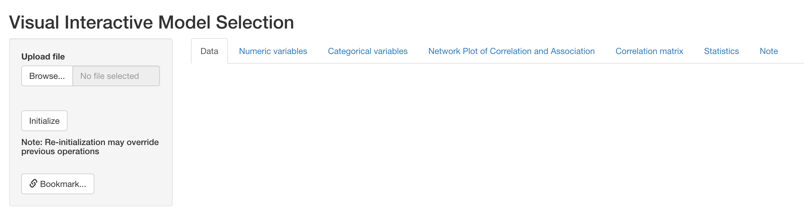
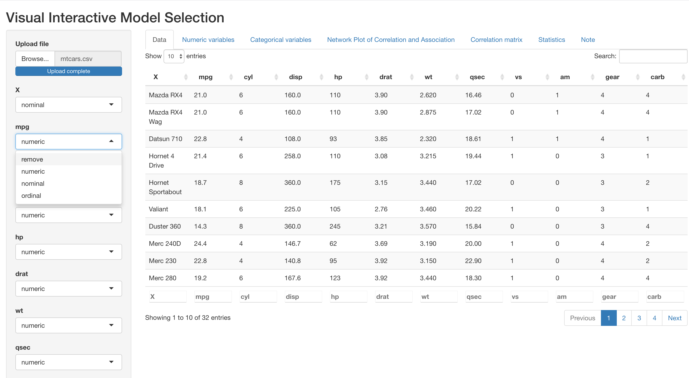
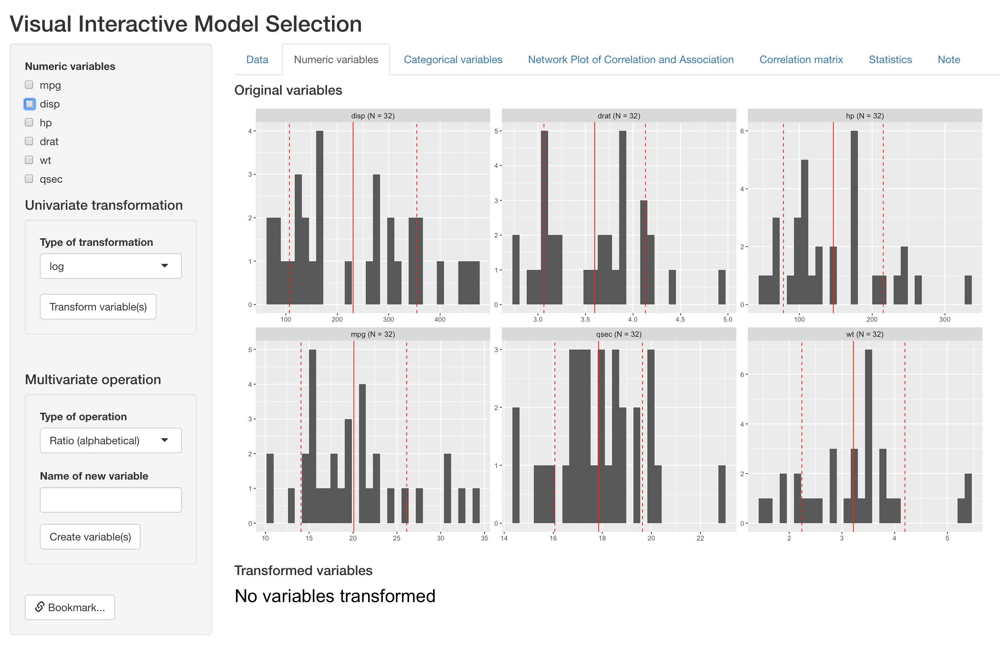
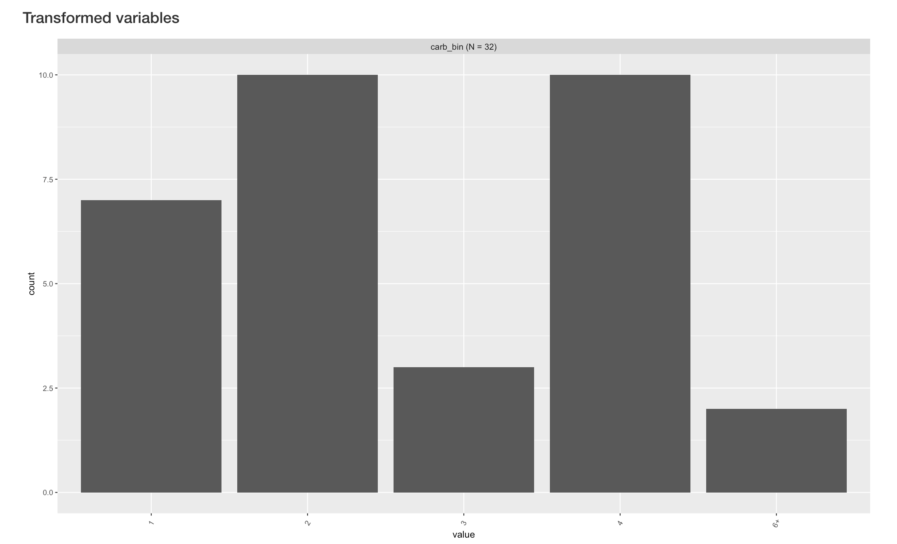
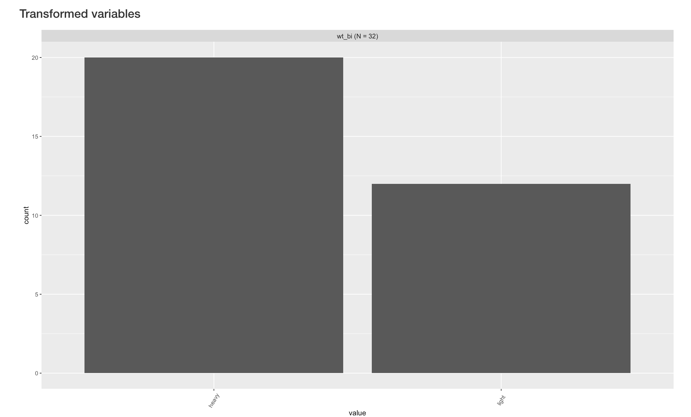
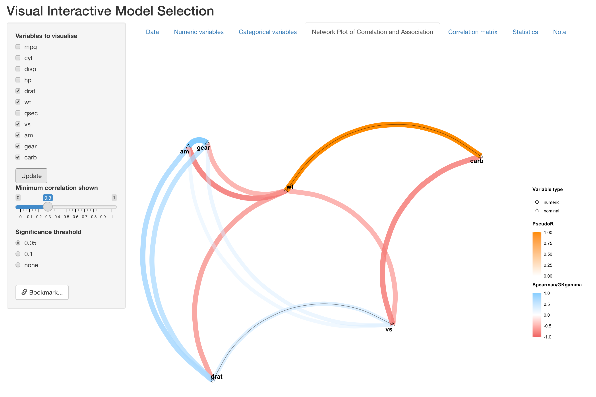
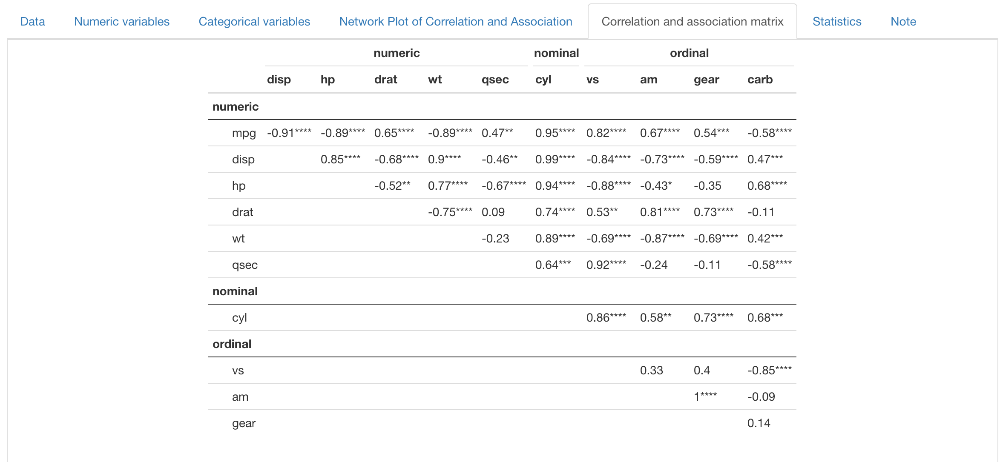

```{r, include = FALSE}
knitr::opts_chunk$set(
  collapse = TRUE,
  comment = "#>"
)
```

```{r setup, echo=FALSE, message=FALSE}
library(devtools)
library(cowplot)
library(magick)
data("mtcars")
```

# Introduction 

The VisX application includes five tabs, supporting operations of data pre-processing or variable selection. Each tab consists of an input panel on the left side and an output panel on the right side. In the following sections, we will illustrate the VisX workflow using "mtcars" data as an example. This data is a built-in data set of R and comprises fuel consumption and 10 aspects of automobile design and performance for 32 automobiles (1973--74 models). A more detailed description of this data can be found at https://stat.ethz.ch/R-manual/R-devel/library/datasets/html/mtcars.html. 

# Upload and initialization

The data tab, which is the first tab of VisX, allows user to upload data file from local directory and initializing variable sets for following analysis. The app currently supports only csv files. 

```{r, echo=FALSE, out.width = '100%', fig.cap="Upload"}

```

After data is uploaded, a preview will appear reactively in the output panel. On the left input panel, user can specify either to remove a variable from the dataset if it is not of interest, or specify the type of each variable (numeric, nominal or ordinal). This is important because the type of variable determines the correlation or association measures used in the NPCA tab (for more details, please see Section 3). 

```{r, echo=FALSE, out.width = '100%', fig.cap="Initialization"}

```

If the dataset includes variables with no variation or all missing values, this will cause failure in the calculation of correlation and association measures. VisX will detect these columns and issue warnings below data preview as follows. In this case, the best practice is to remove such columns.

```{r, echo=FALSE, out.width = '100%', fig.cap="Warning messages. fake_col and fake_col2 are fake variables created for demonstration."}
knitr::include_graphics("tab1-3.png")
```

# Pre-preocessing

The following two tabs, numeric variables and categorical variables, support basic operations for data pre-processing. Please note that for illustration purposes, we have specified the original variable cyl	(number of cylinders) as nominal, and vs (V-shaped or straight engine), am (automatic or manual transmission), gear (number of forward gears) and carb (Number of carburetors) as ordinal. 

## Numeric variables

This tab presents histograms for each numeric variable in the dataset, where mean and one standard deviation around mean marked out respectively with solid and dashed red lines. In the example below, distribution of the six numeric variables in mtcars are displayed. 

```{r, echo=FALSE, out.width = '100%', fig.cap="Distribution of original numeric varaibles"}

```

For a single numeric variables, this tab supports log and square-root transformation under the "Univariate transformation" section. Below is an example of log-transforming two variables (mpg and disp). Users can select all variables to transform and type of transformation on the left input panel. 

```{r, echo=FALSE, out.width="30%", fig.align='center'}
knitr::include_graphics("tab2-2.png")
```

After clicking the "Transform variable(s)" button, histograms of new variables will show up reactively on the right side, below original variables. VisX will name the new variable by adding the type of transformation after the original variable names (e.g. disp_log). 

```{r, echo=FALSE, out.width="80%", fig.align='center'}
knitr::include_graphics("tab2-3.png")
```


This tab also supports creation of composite variables, including ratio of two variables and mean of a set of variables. Below is an example of  
Below we present an example of creating ratio of hp (gross horsepower) and wt (weight). User can select variables for numerator and denominator in the same variable list as before: 

```{r, echo=FALSE, out.width="40%", fig.align='center'}
knitr::include_graphics("tab2-4-1.png")
```

However, the type of operation and the name of new composite variable are now specified under "Multivariate operation" section: 

```{r, echo=FALSE, out.width="40%", fig.align='center'}
knitr::include_graphics("tab2-4-2.png")
```

After clicking the "Create variable(s)" button, histograms of new composite variable will appear reactively on the right side, below original variables. 

```{r, echo=FALSE, out.width="80%", fig.align='center'}
knitr::include_graphics("tab2-5.png")
```

## Categorical variables

This tab presents barplot for each categorical variable in the dataset. As is presented below, the output panel shows distribution of one nominal variable and four ordinal variables.

```{r, echo=FALSE, out.width="100%", fig.align='center'}
knitr::include_graphics("tab3-1.png")
```

For an existing categorical variable, this tabs supports binning existing levels into a new levels, which is particularly useful when a variable can take may different value with small sample size at each value. Below we present an example of binning the "carb" variable (number of carburetors). 

All operations are done under the "Collapsing" section on the left input panel. User can select the variable to operate on, and a list of all unique values will show up reactively under "Levels to collapse". User can then select all the values to bin, specify a name of the new binned level, and specify whether the new binned variable should be coded as nominal or ordinal. 

In this example, cars with 6 or 8 carburetors are collapsed into a single level of "6+". 

```{r, echo=FALSE, out.width="40%", fig.align='center'}
knitr::include_graphics("tab3-2.png")
```


By clicking the "Update" button, the new variable is created and its barplot appears below the original barplots. VisX names the new variable automatically by attaching "bin" after the original variable name. 

```{r, echo=FALSE, out.width="80%", fig.align='center'}

```

This tab also supports create a new binary variable based on numeric variables in the dataset. Relevant operations are implemented under the "Dichotomization" section on the left. User can select a numeric variable to dichotomize, and the threshold bar will be updated reactively to the range of chosen variable. User can then choose the threshold for dchotomization, name the to new levels and specify the type of new binary variable. 

Below is an example of dichotomizing the "wt" (weight) variable into "heavy" and "light" levels. 

```{r, echo=FALSE, out.width="40%", fig.align='center'}
knitr::include_graphics("tab3-4.png")
```

By clicking the "Creat variable" button, the new variable is created and its barplot appears below the original barplots. VisX names the new variable automatically by attaching "bi" after the original variable name. 

```{r, echo=FALSE, out.width="80%", fig.align='center'}

```

# Network plot of correlation an association (NPCA)

The next tab presents a diagram for pairwise similarity between all variables currently in the dataset, which is the major advance from the previous version. In this new diagram, measure and test of association/correlation between a pair of variables is determined by their types, specifically as follows:

- nominal vs numeric, nominal or ordinal: Pseudo $R^2$ and p value from univariate multinomial regression
- ordinal vs ordinal or numeric: GK gamma and GK gamma correlation test
- numeric vs numeric: Spearman correlation and Spearman correlation test

The use of different types of variable and correlation/association measures allows us to treat variable properly, instead of arbitrarily creating numeric dummy variables for nominal variables. The visualization scheme has also been updated with the addition of this new feature, which is explained in the example below:

```{r, echo=FALSE, out.width="100%", fig.align='center'}
knitr::include_graphics("tab4-1.png")
```
In NPCA, each variable is represented as a point in 2-D space, with their type indicated by point shape. As in the figure above, numeric variables are represend by circles. The one nominal variables we specified in the first tab (cyl) is triangle, and the four ordinal variables(vs, am, gear and carb) are diamonds. Position of each variable is determined by their similarity between other variables by CMD scale, so that similar variables are closer to each other. 

We also include two different color scales for different type of correlation/association measures. The directional ones (Spearman and GKgamma correaltion) are represented by pink-blue scale, since their values can be either negative or positive. For the indirectional association, please note that PseudoR, which is the square-root of Pseudo $R^2$, is used so that it is comparable to other correlation measures. This measure is represened by the orange color scale.

Other features remain similar to the previous version, where color hue, transparency and thickness of edges represents the strength of correlation. User can also change the visualization operations on the left panel, such as to remove/include variables, indicate significance of correlation/association with solid black lines overlaying edges, and change threshold of correlation/association strength for visualization.

Below is an example of removing a set of variables:

```{r, echo=FALSE, out.width="80%", fig.align='center'}

```

Below is another example of showing significant correlation/association (p < 0.05):

```{r, echo=FALSE, out.width="80%", fig.align='center'}
knitr::include_graphics("tab4-3.png")
```


## Statistics

The following two tabs are also reactive to the NPCA tab, displaying useful information for variable selection. The "Correlation and association matrix" tab displays the raw value of Spearman/GKgamma correlation or Pseudo R, with significane indicated by stars. Rows and columns are grouped by variable type. 

```{r, echo=FALSE, out.width="80%", fig.align='center'}

```

The "Statistics" tab presents statistics about multicollinearity, including Generalized Variance Inflation Factor (GVIF), before and after adjustment for degress of freedom. R-squared for each variable versus all other variables are also presented. However, for numeric and ordinal variables, R-suqared is extracted for mulitple linear regression, while for nominal variable this quantity is in fact Pseudo R-squared from multinomial regression. 

```{r, echo=FALSE, out.width="80%", fig.align='center'}
knitr::include_graphics("tab6-1.png")
```

# Bookmark and interative use

VisX support interative operation across panels, meaning users can go back to previous panels and do more operations without overriding previous operations (except for the data panel, where re-initialization may overide previous operations). In addition, VisX also supports reproducing results when running on the same server. By clicking "Bookmark" at the bottom in left input panel, a bookmark link is generated, which the user an later open in the browser and retrieve where the app is left. 


